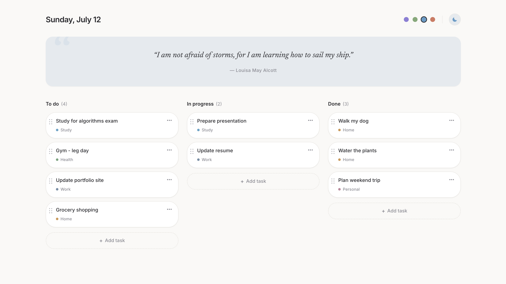
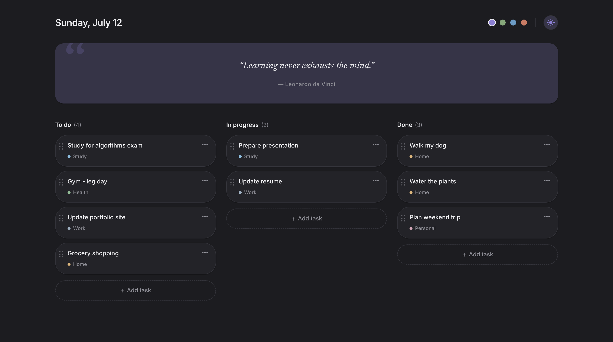
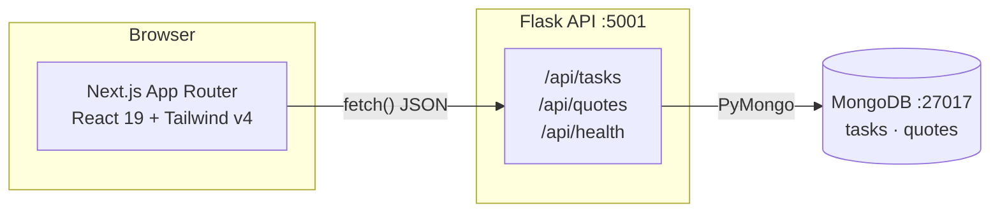

# Taskly

A little personal task manager that's actually nice to open every day. Move tasks across
three columns, pick an accent color that follows you all the way to the browser tab, and
get greeted by a real, honest quote each time you visit.

<p>
  
  
  
  
  
  
</p>

## Overview

Taskly is a personal task manager, organized as three status columns — To do, In
progress, Done — that tasks move between by drag-and-drop. It's a small full-stack
project end to end: a Next.js frontend talking to a Flask + MongoDB API, with a theme
picker that recolors the browser tab icon, a real quote pulled from a seeded collection
of 200 on every visit, and the whole stack runnable either natively or through a single
`docker compose up`.

## Demo

**Light theme**

<p align="center"></p>

**Dark theme**

<p align="center"></p>

## Table of Contents

- [Taskly](#taskly)
  - [Overview](#overview)
  - [Demo](#demo)
  - [Table of Contents](#table-of-contents)
  - [Features](#features)
  - [Architecture](#architecture)
  - [Tech Stack](#tech-stack)
  - [Getting Started](#getting-started)
    - [Prerequisites](#prerequisites)
    - [Clone](#clone)
    - [Option A — Docker Compose](#option-a--docker-compose)
    - [Option B — Local development](#option-b--local-development)
    - [Seed the quotes](#seed-the-quotes)
  - [Environment Variables](#environment-variables)
  - [API Reference](#api-reference)
  - [Database Schema](#database-schema)
  - [Project Structure](#project-structure)

## Features

**Board**
- Three columns — To do / In progress / Done — backed by a single `tasks` collection
- Drag-and-drop reordering within and across columns ([dnd-kit](https://dndkit.com/)), with
  a fractional-indexing scheme so moving one card never touches its neighbors
- Add and delete tasks per column, each tagged with a category

**Personalization**
- Light/dark mode and a 4-color accent picker, persisted to `localStorage`
- The browser tab favicon recolors live to match whichever accent is selected

**Daily quote**
- A random, real, attributed quote loads from a seeded collection of 200 on every page load

## Architecture



The frontend never talks to MongoDB directly — every read/write goes through the Flask
REST API. In Docker, `frontend` and `backend` are separate containers on the Compose
network; the browser itself still calls the backend over `localhost`, since it runs
outside any container.

## Tech Stack

| Layer | Technology |
|---|---|
| Frontend | Next.js 16 (App Router, Turbopack), React 19, TypeScript, Tailwind CSS v4 |
| Drag & drop | [@dnd-kit](https://dndkit.com/) (core, sortable) |
| UI primitives | [shadcn/ui](https://ui.shadcn.com/) on `@base-ui/react` |
| Backend | Flask 3, PyMongo, Gunicorn |
| Database | MongoDB 7 |
| Containerization | Docker, Docker Compose |

## Getting Started

### Prerequisites

| Tool | Version |
|---|---|
| Node.js | 20+ |
| Python | 3.13+ |
| Docker Desktop | for Option A, or just to run MongoDB for Option B |

### Clone

```bash
git clone <repository-url>
cd taskly
```

### Option A — Docker Compose

Builds and runs MongoDB, the backend, and the frontend together:

```bash
docker compose up --build -d
```

| Service | URL |
|---|---|
| Frontend | http://localhost:3000 |
| Backend API | http://localhost:5001 |
| MongoDB | localhost:27017 |

Rebuild a single service after changing its code:

```bash
docker compose up --build -d frontend   # or: backend
```

### Option B — Local development

Start MongoDB:

```bash
docker compose up -d database
```

Backend:

```bash
cd backend
python3 -m venv .venv && source .venv/bin/activate
pip install -r requirements.txt
flask --app wsgi run
```

`backend/.flaskenv` sets `FLASK_APP`, `FLASK_DEBUG`, and `FLASK_RUN_PORT=5001`, so `flask
run` and `python wsgi.py` both start the API on port 5001 with no extra flags.

Frontend, in a second terminal:

```bash
cd frontend
npm install
npm run dev
```

### Seed the quotes

Populates the `quotes` collection — required once, either option, before
`/api/quotes/random` returns anything:

```bash
cd backend
source .venv/bin/activate
python scripts/seed_quotes.py
```

## Environment Variables

Optional — defaults already point at `localhost`. Copy the `.env.example` in each service
to override them.

**`backend/.env`** (copy from `backend/.env.example`)

| Variable | Default | Description |
|---|---|---|
| `MONGO_URI` | `mongodb://localhost:27017/taskly` | Connection string used by Flask/PyMongo |

**`frontend/.env.local`** (copy from `frontend/.env.example`)

| Variable | Default | Description |
|---|---|---|
| `NEXT_PUBLIC_API_URL` | `http://localhost:5001` | Base URL the browser calls for the API |

## API Reference

Prefixed with `/api`. Writes return the updated task; errors return `{"error": "<message>"}`
with `400` (validation) or `404` (not found).

| Method | Endpoint | Description |
|---|---|---|
| `GET` | `/api/tasks` | List all tasks, sorted by column then order |
| `POST` | `/api/tasks` | Create a task |
| `PATCH` | `/api/tasks/:id` | Update any subset of `title` / `category` / `status` / `order` |
| `DELETE` | `/api/tasks/:id` | Delete a task |
| `GET` | `/api/quotes/random` | Return one random quote from the seeded collection |
| `GET` | `/api/health` | Liveness check — `{"status": "ok"}` |

<details>
<summary><code>GET /api/tasks</code></summary>

Response — `200 OK`:
```json
[
  {
    "id": "665f1c2e8a1b2c3d4e5f6789",
    "title": "Water the plants",
    "category": "Home",
    "status": "todo",
    "order": 0,
    "created_at": "2026-07-12T10:15:00+00:00",
    "updated_at": "2026-07-12T10:15:00+00:00"
  }
]
```
</details>

<details>
<summary><code>POST /api/tasks</code></summary>

`title` and `category`: required, non-empty strings. `status`: one of `todo`,
`in_progress`, `done`.

Request:
```json
{ "title": "Water the plants", "category": "Home", "status": "todo" }
```

Response — `201 Created`:
```json
{
  "id": "665f1c2e8a1b2c3d4e5f6789",
  "title": "Water the plants",
  "category": "Home",
  "status": "todo",
  "order": 0,
  "created_at": "2026-07-12T10:15:00+00:00",
  "updated_at": "2026-07-12T10:15:00+00:00"
}
```
</details>

<details>
<summary><code>PATCH /api/tasks/:id</code></summary>

Any subset of `title` / `category` / `status` / `order`; at least one required. Also how
the board persists a drag-and-drop move.

Request:
```json
{ "status": "done", "order": 2 }
```

Response — `200 OK`: the full task object, with `updated_at` refreshed.
</details>

<details>
<summary><code>DELETE /api/tasks/:id</code></summary>

Response — `204 No Content` (empty body).
</details>

<details>
<summary><code>GET /api/quotes/random</code></summary>

Response — `200 OK`:
```json
{
  "id": "6a5290cb33b75d2c7dd624c8",
  "text": "The present is theirs; the future, for which I really worked, is mine.",
  "author": "Nikola Tesla"
}
```
</details>

<details>
<summary>Validation error example</summary>

Request — `POST /api/tasks` with an empty title:
```json
{ "title": "", "category": "Home", "status": "todo" }
```

Response — `400 Bad Request`:
```json
{ "error": "'title' is required and must be a non-empty string." }
```
</details>

## Database Schema

MongoDB is schemaless — this is the shape enforced by the API's validation layer, not the
database itself.

**`tasks`**

| Field | Type | Notes |
|---|---|---|
| `_id` | ObjectId | Mongo-generated; exposed over the API as `id` (string) |
| `title` | string | Required, non-empty, trimmed |
| `category` | string | Required, non-empty. The UI offers Study / Work / Health / Home / Personal, but the API accepts any non-empty string |
| `status` | string | Required. One of `todo`, `in_progress`, `done` |
| `order` | float | Position within its column. New tasks get `max(order in column) + 1`; a moved task gets the midpoint between its new neighbors, so reordering one card never touches the others |
| `created_at` | datetime (UTC) | Set once, on creation |
| `updated_at` | datetime (UTC) | Refreshed on every successful `PATCH` |

**`quotes`**

| Field | Type | Notes |
|---|---|---|
| `_id` | ObjectId | Exposed over the API as `id` (string) |
| `text` | string | The quote itself |
| `author` | string | Attribution |

Populated via `backend/scripts/seed_quotes.py` (200 entries). `GET /api/quotes/random`
uses MongoDB's `$sample` stage, so repeats are possible.

## Project Structure

```
taskly/
├── docker-compose.yml
├── backend/
│   ├── app/
│   │   ├── __init__.py       # app factory, CORS, blueprint registration
│   │   ├── config.py         # env-driven config
│   │   ├── db.py             # single MongoClient per process
│   │   ├── validation.py     # request payload validation
│   │   └── routes/
│   │       ├── tasks.py      # /api/tasks CRUD
│   │       └── quotes.py     # /api/quotes/random
│   ├── scripts/seed_quotes.py
│   └── wsgi.py
└── frontend/
    ├── app/                  # root layout (incl. favicon script), page
    ├── components/
    │   ├── board/            # Board, Column, TaskCard, AddTaskDialog, QuoteCard, Topbar
    │   └── ui/                # shadcn/ui primitives (button, dialog, select, …)
    ├── hooks/                 # use-tasks, use-theme
    └── lib/                   # api client, theme, categories
```
